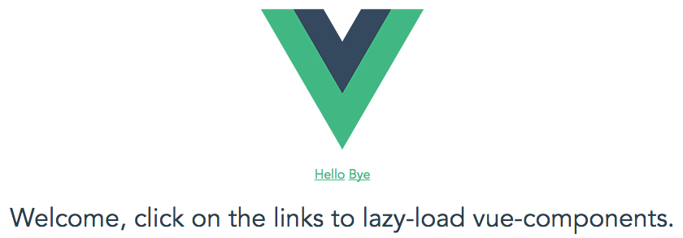

# Vue-lazy

> A vue.js boilerplate using vue-router with lazy-loaded components/views incl. code splitting with webpack and more.



## Build Setup

``` bash
# install dependencies
npm install

# serve with hot reload at localhost:8080
npm run dev

# build for production with minification
npm run build
```

## Where do I start?

Just look at the contents of the src/ directory starting with src/main.js.

For detailed explanation on how things work, checkout the [guide](http://vuejs-templates.github.io/webpack/) and [docs for vue-loader](http://vuejs.github.io/vue-loader).